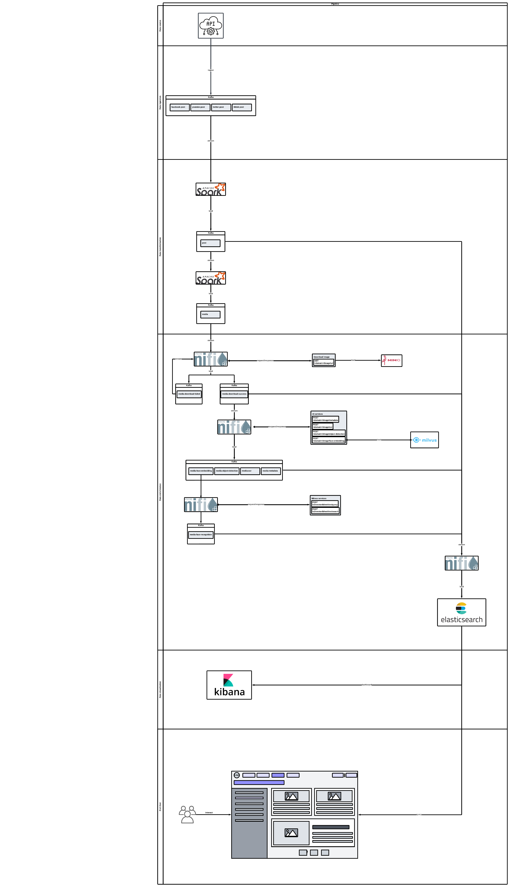

# media-pipeline
To be continue....
# Pipeline

# Description
## Data source
There are some crawlers collecting data (profile, post, reaction) based on inspecting social network APIs. The data will be ingested into Kafka. Posts are from:
- facebook
- youtube
- twitter
- tiktok
- other websites

## Data ingestion
### Schema Post
Only list main attributes
|Field|Description|
|---|---|
|item|struct|
|item.post_id|string|
|item.author_id|string|
|item.content||string|
|item.num_comment|integer|
|item.num_reaction|interger|
|item.url|string|
|item.content|string|
|item.description|string|
|item.media|array[string]|
|item.created_at|timestamp|
|meta|struct|
|meta.channel_name|string|
|meta.crawled_at|timestamp|

## Data transformation
### Schema Post
Only list main attributes
|Field|Description|
|---|---|
|post_id|string|
|author_id|string|
|content|string|
|url|string|
|description|string|
|channel_name|string|
|num_reaction|integer|
|num_comment|integer|
|created_at|datetime|

### Schema Media
Only list main attributes
|Field|Description|
|---|---|
|post_id|string|
|author_id|string|
|media_id|string|
|url|string|
|created_at|timestamp|
|channel_name|string|
|created_at|datetime|
