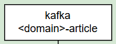

# media-pipeline
To be continue....
# Pipeline

## Description

- First line is a platform name
- Second line is a topic name

  

- First line is a platform name
- Second line is a processor group name

  

- First line is a platform name
- Second line is a spark job name

  

- First line is a platform name
- Second line is a elastichsearc index
